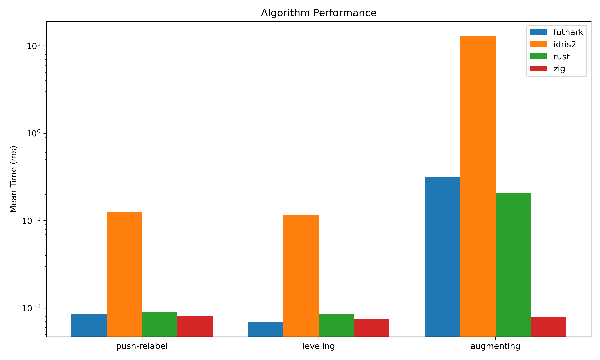
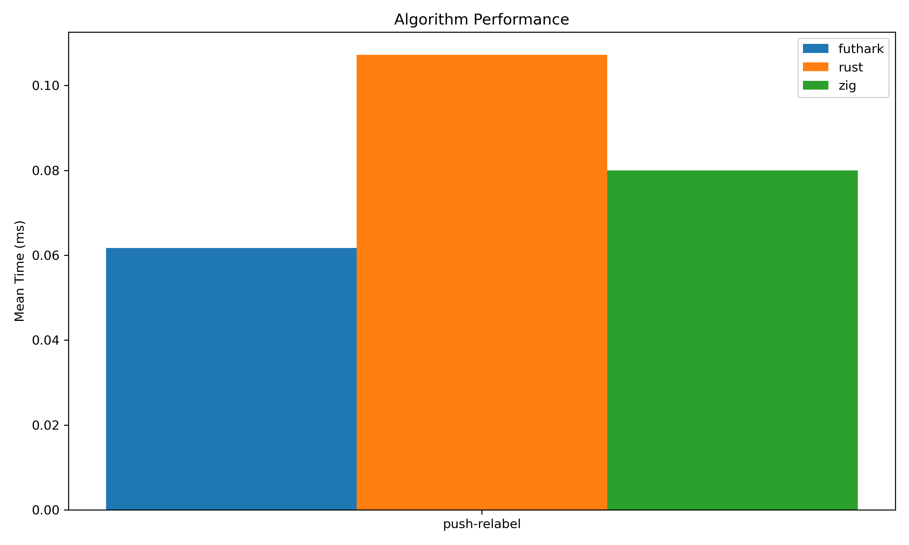

# Graph Orientation with Degree Bounds

This project orients an undirected graph so that every vertex `v` has indegree at most `g[v]`. If no feasible orientation exists, the program emits a violating vertex set.

The Rust crate exposes a single file-based interface:

- read `input.txt`
- write `output.txt`

The runtime is deterministic. The default solver path is Rust, but the binary can dispatch to native backend libraries through FFI.

---
## Binaries

- `main`: backend-dispatching entry point
- `augmenting`: Rust Edmonds–Karp
- `leveling`: Rust Dinic
- `push-relabel`: Rust Push–Relabel

---
## Backend selection

Run:

`./result/bin/graph_orientation --engine <engine> --algorithm <algorithm>`

- Engines: `rust`, `futhark`, `idris2` `zig`
- Algorithms: `augmenting` (Edmonds-Karp), `leveling` (Dinic), `push-relabel`

_Note: You can also use cargo directly:_ `cargo run --features futhark-backend,ffi-backend --bin main -- --engine rust --algorithm push-relabel`

---
## Build

Building the project requires Nix to perfectly encapsulate the cross-language FFI dependencies (Idris 2 RTS, Zig compiler, Futhark, C toolchains).

```bash
nix build
# or
cargo build --feature <features>
```

---
## Architecture & Notes

The Rust side uses the `futhark-bindgen` crate for Futhark, and a raw C ABI for other backend interoperability (Zig, Idris 2). That keeps the interface direct, avoids subprocess orchestration, and allows zero-copy data passing where applicable.

---
## Benchmarks

Because graph orientation via max-flow is an irregular workload, different memory management strategies and concurrency models yield vastly different results.

Below are the performance benchmarks executed via `hyperfine`.



### Results tables

_Note: Results are sorted from fastest to slowest._

| Command | Mean [ms] | Min [ms] | Max [ms] | Relative |
|:---|---:|---:|---:|---:|
| `futhark (leveling)` | 6.9 ± 1.0 | 4.9 | 15.0 | 1.00 |
| `zig (leveling)` | 7.4 ± 1.0 | 6.0 | 15.2 | 1.09 ± 0.22 |
| `zig (augmenting)` | 7.9 ± 1.6 | 5.0 | 12.7 | 1.15 ± 0.29 |
| `zig (push-relabel)` | 8.1 ± 1.0 | 6.0 | 14.5 | 1.18 ± 0.23 |
| `rust (leveling)` | 8.5 ± 1.2 | 6.5 | 15.7 | 1.23 ± 0.25 |
| `futhark (push-relabel)` | 8.6 ± 2.3 | 6.1 | 25.1 | 1.26 ± 0.39 |
| `rust (push-relabel)` | 9.1 ± 2.0 | 6.8 | 18.0 | 1.32 ± 0.36 |
| `idris2 (leveling)` | 116.4 ± 7.8 | 108.5 | 137.6 | 16.97 ± 2.83 |
| `idris2 (push-relabel)` | 127.3 ± 6.2 | 113.7 | 145.7 | 18.57 ± 2.98 |
| `rust (augmenting)` | 206.4 ± 15.6 | 195.2 | 257.7 | 30.10 ± 5.12 |
| `futhark (augmenting)` | 315.1 ± 5.1 | 309.0 | 326.9 | 45.95 ± 7.05 |
| `idris2 (augmenting)` | 13123.6 ± 1023.8 | 12108.8 | 14538.6 | 1914.01 ± 327.99 |

- Push-Relabel benchmark on 10000 nodes and 50000 edges:

| Command | Mean [ms] | Min [ms] | Max [ms] | Relative |
|:---|---:|---:|---:|---:|
| `futhark (push-relabel)` | 61.7 ± 4.9 | 52.8 | 78.1 | 1.00 |
| `zig (push-relabel)` | 80.0 ± 20.1 | 57.6 | 122.8 | 1.30 ± 0.34 |
| `rust (push-relabel)` | 107.2 ± 16.2 | 87.7 | 148.9 | 1.74 ± 0.30 |



### Benchmark observations

- Dimensions: I have experimented with various graph sizes, and on large/dense graphs futhark can defeat sequential implementations if the memory layout is beneficial. Zig is on par with futhark no matter what, and generally the fastest. _note: I ran these benchmarks on an older laptop, with considerable memory pressure_
- Idris 2 overhead: The 12-second execution time of idris2 (augmenting) highlights the cost of FFI boundary crossings (prim__arrayGet) and closure allocations inside tight loops. Upgrading to Dinic or Push-Relabel in Idris completely collapses this overhead by drastically reducing the number of BFS passes required.
- Zig vs Rust: Both compile to extremely tight machine code, operating near identically for optimized algorithms.

